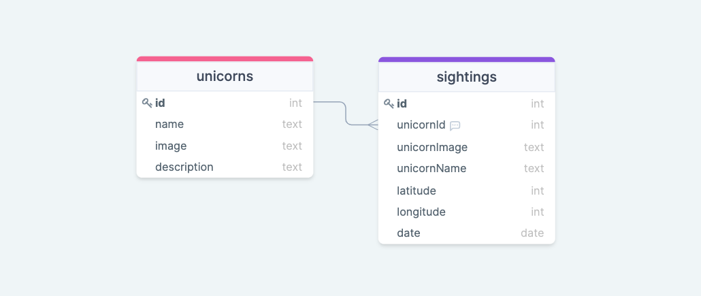
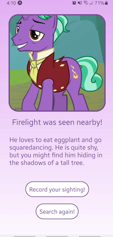
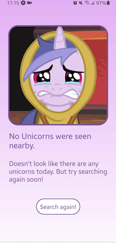
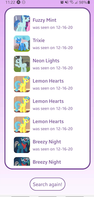

# Unicorn Detector!

### A mobile app that allows you to find out if there are any unicorns nearby and to see past unicorn sightings.

## Features

#### * Allows user to use location data to search for unicorns
#### * If there is one nearby, then user can record sighting
#### * User can also see a list of previously logged sightings

---
## Motivation
#### During fire season last fall when the air was really bad, we got an air quality detector. It is just a white box with a single green LED on it, and we told our daughter that it was a unicorn detector and that if there were any unicorns nearby, the light would change color. My wife had the idea to make a mobile app to continue with that ruse.

---
## User Stories 

#### * On home screen, there is search button and ‘local sightings’ button
#### * User presses search button that uses device’s location to query a weather API
#### * Once weather results are returned, temp and other conditions are used to then search the unicorn database to return a possible unicorn nearby (ie, if temp is between 65-68, and wind is over 10 mph, return “A unicorn was spotted nearby!” and render an image unicorn with name and description, pulled from DB
#### * Some sort of animation (spinning wheel, etc) to run while both searches are happening
#### * If a nearby unicorn is returned (not always the case), users will have the option to record the sighting
#### * Sightings button will display all recent unicorn sightings. This would include the unicorn image, name, date of sighting, and possibly approximate distance from the user's device. 
#### * When viewing the sightings, the button at bottom of screen switches to a “Search for unicorns” button

---
####  Wireframes:

####  


####  ERD:

####  


## Planning Documentation
#### Can be found [here.](https://trello.com/b/bvfaBIOa/unicorn-detector)


####  Screenshots:


####    


---

## Technologies & Code Snippets
#### * JavaScript, Node.JS, ExpressJS, Sequelize, PostgresQL, React, React-Native, Expo
#### * Sample code:
#### 
```
   // get location coordinates
   const getLocation = async () => {
      const { status } = await Permissions.askAsync(Permissions.LOCATION)
      if (status !== 'granted') {
         console.log('location permission not granted')
         setErrorMsg("Permission not granted")
      }
      // use device's location and store lat and long to state of 'location'
      const userLocation = await Location.getCurrentPositionAsync()
      setLat(userLocation.coords.latitude)
      setLon(userLocation.coords.longitude)
   }
   
   // get weather data
   const getWeather = async () => {
      const res = await fetch(`http://api.openweathermap.org/data/2.5/weather?lat=${lat}&lon=${lon}&APPID=${API_KEY}&units=imperial`)
      const json = await res.json()
      setTemp(Math.round(json.main.temp))
   }

   // get weather data and populate unicorn array
   useEffect(() => {
      if (lat && lon) {
         getWeather();
      }
   }, [lat, lon])


```


#### 
```
return (
      <View style={styles.container}>
         <LinearGradient colors={['transparent', 'white']} style={styles.backgroundGradient} />
         <Image
            source={{ uri: unicorn.image }}
            style={styles.image}
         />
         <View style={styles.descriptionContainer}>
            {unicorn.id === 64 ?
               <Text style={styles.title}>{unicorn.name} were seen nearby.</Text>
               : <Text style={styles.title}>{unicorn.name} was seen nearby!</Text>}
            <Text style={styles.description}>
               {unicorn.description}
            </Text>
         </View>
         {unicorn.id !== 64 ?
            <TouchableOpacity
               style={styles.button}
               onPress={createSighting}
            >
               <Text style={styles.buttonText}>Record your sighting!</Text>
            </TouchableOpacity> : null}

         <TouchableOpacity
            style={styles.button}
            onPress={() => navigation.navigate('Home')}
         >
            <Text style={styles.buttonText}>Search again!</Text>
         </TouchableOpacity>
      </View>
   );
```
---
## Backend repo
#### Can be found [here.](https://github.com/enbre/unicorn-detector-backend)

---
## Credits
#### My General Assembly instructors, TAs, and class mates were very helpful, as well as numerous video tutorials to better understand React Native and Expo. 

---

## Future development
#### Additions to come will be minor debugging, adding an animation while unicorns are being searched for, the ability to only show nearby sightings, and eventually show the sightings as pins on a map instead of showing a list.


